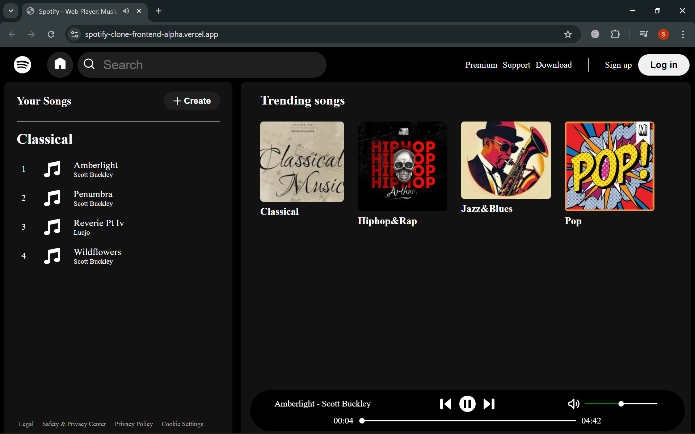

# 🎧 Spotify Clone (Frontend)


A **fully functional Spotify-inspired music player built using Vanilla JavaScript, HTML, and CSS**.
The goal of this project was to deepen my understanding of **core frontend development concepts** such as DOM manipulation, asynchronous JavaScript, dynamic rendering, and responsive UI design.

The application dynamically loads playlists, manages audio playback, and implements interactive player controls similar to a real music streaming interface.

🔗 **Live Demo:**
https://spotify-clone-frontend-alpha.vercel.app/

---

# 📸 Preview


```

```

---

# ✨ Features

### 🎵 Dynamic Playlist System

* Playlists are generated dynamically from folder/JSON data.
* Clicking a playlist loads its songs instantly.

### ▶️ Custom Music Player

* Play
* Pause
* Next track
* Previous track

### ⏱ Interactive Seek Bar

* Real-time progress tracking
* Drag to change playback position

### 🔊 Volume Control

* Custom draggable volume slider
* Smooth real-time volume adjustment

### 🎴 Dynamic Playlist Cards

* Playlist UI generated entirely through JavaScript

### 📱 Responsive Design

* Works across desktop, tablet, and mobile screens

### ⚡ Optimized DOM Rendering

* Uses **DocumentFragment** for efficient DOM updates when rendering song lists

---

# 🛠 Tech Stack

| Technology           | Purpose                 |
| -------------------- | ----------------------- |
| **HTML5**            | Application structure   |
| **CSS3**             | Styling and layout      |
| **JavaScript (ES6)** | Interactivity and logic |
| **Fetch API**        | Loading playlist data   |
| **HTML5 Audio API**  | Music playback          |
| **Vercel**           | Deployment              |

The project intentionally avoids frameworks to focus on **strong fundamentals of frontend development**.

---

# 📂 Project Structure

```
spotify-clone
│
├── index.html
├── style.css
├── script.js
├── songs.json
│
├── Assets
│   └── svg
│       ├── play.svg
│       ├── pause.svg
│       ├── music.svg
│       └── icons...
│
└── songs
    ├── Classical
    │   ├── cover.jpg
    │   ├── song1.mp3
    │   └── song2.mp3
    │
    └── Pop
        ├── cover.jpg
        ├── song3.mp3
        └── song4.mp3
```

---

# 🚀 Getting Started

## 1️⃣ Clone the repository

```bash
git clone https://github.com/your-username/spotify-clone.git
```

## 2️⃣ Navigate into the project

```bash
cd spotify-clone
```

## 3️⃣ Run locally

Open the project with **Live Server** in VS Code or simply open `index.html` in your browser.

---

# 🧠 What I Learned

While building this project I practiced and improved my understanding of:

* DOM manipulation
* Event-driven programming
* Async / Await
* Fetch API
* Audio API
* Dynamic UI rendering
* Responsive layout techniques
* Managing project folder structures
* Debugging path and deployment issues

---

# 🚀 Future Improvements

Planned upgrades to make the project closer to a real music streaming platform:

* 🔍 Song search functionality
* 🔀 Shuffle and repeat playback
* 🎶 Playlist metadata (artist, description)
* ⌨️ Keyboard shortcuts for playback
* 💿 Better player animations
* 📊 Display song duration inside playlists
* ☁️ Backend integration for streaming APIs
* ❤️ Like / save songs feature

---

# 🙏 Acknowledgements

This project was built while learning from the tutorial by **Code With Harry** on YouTube, along with additional improvements and custom implementations to better understand frontend development.

UI inspiration from **Spotify**.

---

# ⭐ Support

If you like this project:

* ⭐ Star the repository
* 🍴 Fork it and build your own version
* 💡 Suggest improvements

---

# 📬 Contact

If you'd like to connect or discuss frontend development:

GitHub: https://github.com/your-username

---

> Built for learning and improving frontend engineering skills.


